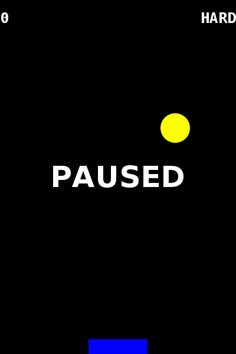

# superjg

superjg is a vanilla Java game engine, written as a template base to create video games.

The base implementation is a Pong-like game.

___

## Engine components

* *__com.example.superjg.cfg__*: This package stores the game configuration used by the game and the configuration editor.
* *__com.example.superjg.cfg.editor__* This package has the clases for the configuration editor.
* *__com.example.superjg.cfg.game__* This package has the clases for the game.
* *__com.example.superjg.cfg.utils__* This package stores utility functions in common.

---

## Pong instructions

Use the `LEFT` and `RIGHT` arrows to move the racquet before the ball gets the floor. Get as much score as possible in the __HARD__ mode.

Press `ESCAPE` to pause the game.

Here is how the game looks like:

*(c) 2020 Superunknown*